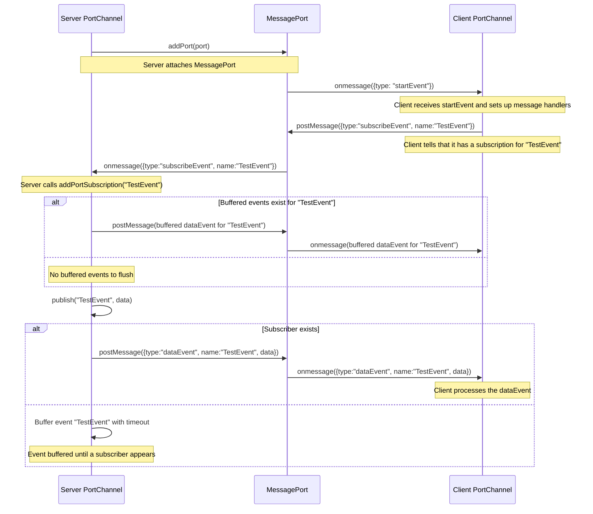

# @collidor/event

[](https://codecov.io/gh/collidor/event)
[](https://www.npmjs.com/package/@collidor/event)
[](https://opensource.org/licenses/MIT)

A lightweight event system with cross-context communication. Perfect for modern web apps, workers, and distributed systems.

---

## Installation

```bash
npm install @collidor/event
```

---

## Core Features

- Class-based event system with strict typing
- Cross-context communication (Window ↔ Worker ↔ Tab)
- Built-in support for BroadcastChannel/SharedWorker
- Context propagation & AbortController integration

## Basic Usage

```ts [Event Definition]
import { Event } from "@collidor/event";

class UserUpdate extends Event<{ id: string }> {}
class SystemAlert extends Event<string> {}
```

```ts [Event Bus]
import { EventBus } from "@collidor/event";

const bus = new EventBus();

// Subscribe
bus.on(UserUpdate, (data) => {
  console.log(`User ${data.id} updated`);
});

// Publish
bus.emit(new UserUpdate({ id: "123" }));
```

---

## Cross-Context Patterns

The PortChannel is the main exported channel, it accepts `MessagePortLike` ports, which
have a `postMessage` method, and can set and use a `onmessage` property callback. This means that
the browsers APIs like BroadcastChannel, Worker and SharedWorker will work by default.

My plan is to add adapters later so other things can behave like ports, like Websockets, WebRTC, Http+SEE and Datagrams.

The PortChannel will not emit events to ports that didn't send a message first telling that it has a subscriber for such event.

### 1. BroadcastChannel (Tab-to-Tab)

```ts [Tab A]
import { PortChannel, EventBus } from "@collidor/event";

const channel = new PortChannel();
const bus = new EventBus({ channel });
channel.addPort(new BroadcastChannel("app-channel"));

class TabMessage extends Event<string> {}
bus.emit(new TabMessage("Hello from Tab A!"));
```

```ts
import { PortChannel, EventBus } from "@collidor/event";

const channel = new PortChannel();
const bus = new EventBus({ channel });
channel.addPort(new BroadcastChannel("app-channel"));

bus.on(TabMessage, (msg) => {
  console.log("Received:", msg); // "Hello from Tab A!"
});
```

---

### 2. SharedWorker (Multi-Context)

```ts
import { PortChannel, EventBus } from "@collidor/event";

const channel = new PortChannel();
const bus = new EventBus({ channel });
const worker = new SharedWorker("worker.js");

channel.addPort(worker.port);

class TaskEvent extends Event<{ id: string }> {}
bus.emit(new TaskEvent({ id: "shared-task" }));
```

```ts
import { PortChannel, EventBus } from "@collidor/event";

const channel = new PortChannel();
const bus = new EventBus({ channel });

// Handle new connections
self.onconnect = (event) => {
  const port = event.ports[0];
  channel.addPort(port);
};

self.start();

bus.on(TaskEvent, ({ id }) => {
  console.log("Processing shared task:", id);
});
```

---

## Advanced Patterns

### Context Propagation
```ts
const bus = new EventBus({
  context: { requestId: "123" }
});

bus.on(DataEvent, (data, ctx) => {
  console.log(ctx.requestId); // "123"
});

// Override per emission
bus.emit(new DataEvent(), { requestId: "temp" });
```

---

## API Overview

### EventBus
- `on(event, handler, signal?)`
- `off(event, handler)`
- `emit(event, context?)`
- `emitByName(name, data, context?)`

### PortChannel
- `addPort(port)`
- `removePort(port)`
- `publish(event)`
- `subscribe(name, callback)`
- `unsubscribe(name, callback)`

#### PortChannel sequence diagram



---

## Development

```bash [Commands]
# Install dependencies
npm install

# Run tests (requires Deno)
npm test

# Build project
npm run build
```

---

*MIT License | © 2024 [Alykam Burdzaki](https://alykam.com)*
*[Report Issues](https://github.com/collidor/event/issues)*